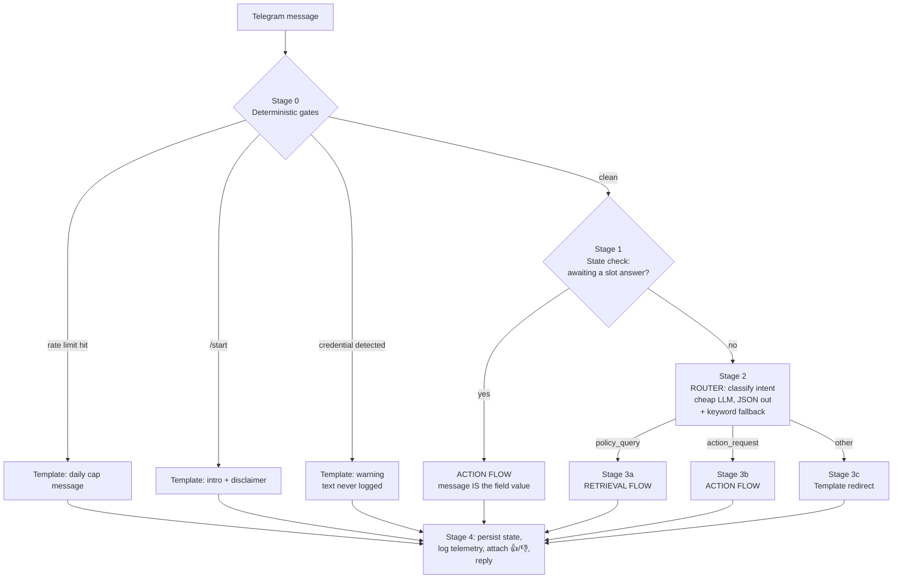

# SahaayakAI — System Architecture (Design Doc)

**Status:** v1.0 · Companion to PRD Section 6
**Method:** We lay out the complete message flow first, enumerate every
responsibility in it, and only then decide which responsibilities deserve to
be an "agent." The agent count is a conclusion, not an assumption.

---

## 1. The Flow, End to End

A single seller message passes through **five stages**. Stages 0–1 are pure
deterministic code (no LLM). LLM calls appear only in stages 2–3, and only
where a judgment call is genuinely required.



### Stage 0 — Deterministic gates (code, zero LLM cost)
Order matters; each gate can terminate the turn:

1. **Rate limit** — sliding 24h window per chat (`DAILY_MESSAGE_CAP`). Cost
   guard against runaway usage.
2. **`/start`** — canned Hinglish intro with 3 example queries + the
   "drafts are suggestions, review before submitting" disclaimer (P0.5).
3. **Credential guard** — regex detection of passwords / OTPs / CVV / bank
   details. Fires **before any LLM sees the text**, replies with a warning,
   and telemetry stores the event but never the message content. This gate
   is deliberately not an LLM call: a safety property must not depend on a
   model's mood or an API being up.

**Design rule established here:** anything that must be *guaranteed* is code;
LLMs only get the jobs where judgment is required.

### Stage 1 — Conversation-state check (code)
If the bot's previous turn asked for a specific field ("Order ID kya hai?"),
the current message **is** that field's value — regardless of what it looks
like. This check runs *before* classification because of a real failure we
hit in testing: a seller answering "what's the problem?" with *"customer ne
used kurta bheja wapas"* was classified as a new policy question and hijacked
out of the draft flow. The state machine, not the classifier, owns this
decision. (`ChatState.awaiting_field`, regression-tested.)

### Stage 2 — Routing (first LLM touchpoint)
A single cheap-model call returns strict JSON:
`{intent: policy_query|action_request|other, language: hinglish|english, marketplace: meesho|amazon|null}`.
It receives a one-line context hint (pending draft? last topic?) so
follow-ups like *"aur agar fake return ho?"* resolve against the prior topic
(P0.3 multi-turn requirement).

**Degradation:** if the call fails or returns unparseable JSON, a
deterministic keyword classifier takes over (measured at 96% on the 50-query
eval — above the 90% P0 bar on its own). The bot never goes down because the
router did.

### Stage 3a — Retrieval flow (the conservative path)

```
question ──► embed ──► vector search (top-4, marketplace-filtered)
                              │
                    confidence gate: best distance ≤ MAX_DISTANCE?
                     │ no                            │ yes
                     ▼                               ▼
          honest "not found" reply        strong LLM composes answer
          (template, zero LLM)            ONLY from retrieved chunks
                                                     │
                                          model may output NO_ANSWER
                                          (second escape hatch) ──► "not found"
                                                     │
                                          answer + "Source: doc / section"
```

Two independent hallucination brakes: a **numeric gate** (retrieval distance
threshold) and a **prompt-contract gate** (the model must reply `NO_ANSWER`
if the chunks don't actually answer the question). Both must pass for a
policy claim to reach a seller. This is how PRD Goal 5 (zero hallucinated
policy claims) is enforced structurally rather than hoped for.

### Stage 3b — Action flow (the productive path)

A small state machine, not a free-form conversation:

```
 ┌─────────────┐  draft type unknown   ┌──────────────────┐
 │ EXTRACT      │ ────────────────────►│ ASK: which draft? │
 │ (cheap LLM,  │                      └──────────────────┘
 │ JSON fields) │  draft type known
 └──────┬───────┘
        ▼
 ┌──────────────┐  mandatory field missing  ┌────────────────────┐
 │ SLOT CHECK   │ ─────────────────────────►│ ASK one field,      │──► set
 │ (pure code)  │◄──────────────────────────│ set awaiting_field  │    state,
 └──────┬───────┘   answer arrives (Stage 1)└────────────────────┘    wait
        │ all mandatory fields present
        ▼
 ┌──────────────────────────────────────────────┐
 │ GROUND: call Retrieval flow for policy text   │  (agent-of-agents edge)
 └──────┬───────────────────────────────────────┘
        ▼
 ┌──────────────────────────────────────────────┐
 │ COMPOSE draft (strong LLM): facts = fields    │
 │ ONLY, policy quotes cited, no placeholders,   │
 │ ends with review disclaimer                   │
 └──────────────────────────────────────────────┘
```

Key contracts: mandatory fields are asked **one at a time** (mobile UX);
the composer is forbidden from inventing values — a missing optional field
is omitted, never `[PLACEHOLDER]`-ed (P0.4). The grounding call is the one
place an agent invokes another agent.

### Stage 3c — Fallback (template, zero LLM)
Greetings/off-topic get a canned redirect. No model call: nothing to judge.

### Stage 4 — Egress (code)
Persist `ChatState` to SQLite (drafts survive restarts) → append telemetry
row (hashed chat id, intent, latency, groundedness, citation count) → attach
👍/👎 buttons → send.

---

## 2. Deriving the Agent Count

Now enumerate every responsibility the flow revealed, and classify it. Our
bar for calling something an **agent**: it needs (a) its own LLM prompt
contract, (b) its own *failure-mode bias*, and (c) independent testability.
Everything else is either plain code or a sub-call inside an agent.

| # | Responsibility | Judgment needed? | Failure-mode bias | Verdict |
|---|---|---|---|---|
| 1 | Rate limit, /start, credential guard | No — must be guaranteed | n/a | **Code** (Stage 0) |
| 2 | Slot-answer override | No — state machine | n/a | **Code** (Stage 1) |
| 3 | Intent + language + marketplace classification | Yes — fuzzy Hinglish input | be *decisive*, cheap, fast | **Agent: Orchestrator/Router** |
| 4 | Policy question answering | Yes — synthesis from chunks | be *conservative*: refuse > guess | **Agent: Retrieval** |
| 5 | Field extraction from conversation | Yes — messy free text → JSON | extract only what's stated | sub-call **inside Action agent** (shares its data contract) |
| 6 | Draft composition | Yes — persuasive writing | be *productive*: always complete, never placeholder | **Agent: Action** |
| 7 | Vector search + confidence gate | No — math | n/a | **Code** (store + threshold) |
| 8 | Off-topic redirect | No | n/a | **Code** (template) |
| 9 | State, persistence, telemetry | No | n/a | **Code** |

**Result: 3 agents, 4 prompt contracts** (the Action agent owns two prompts —
extractor and composer — because they share one data schema and one failure
bias, and are always used together).

### Why not fewer (one mega-prompt)?
Responsibilities #4 and #6 have **opposite failure-mode biases**. The
retrieval answerer must prefer "I don't know" over invention; the draft
composer must never hand back an incomplete artifact. One prompt serving both
masters does both badly — our early single-prompt experiments either produced
timid drafts or confident policy fiction. Separation also unlocks a cost
structure: the router and extractor run on a cheap fast model, only
composition uses the expensive one (~50% cost reduction per conversation),
and each contract gets its own eval (routing eval, groundedness audit, draft
completion rate) — you cannot attribute a failure you cannot isolate.

### Why not more?
Candidates we explicitly rejected for v1:
- **Language-detection agent** — one field in the router's JSON. A separate
  call adds latency and cost for zero quality gain.
- **Marketplace-classifier agent** — same; one router field + sticky state.
- **Citation-verifier agent** (reads the drafted answer, checks every claim
  against the chunks, can veto) — genuinely valuable, but the two existing
  hallucination brakes + weekly human audit cover P0. This is the **first
  agent we'd add** in v2 if audits show leakage. Designed-for, not built.
- **Escalation/handoff agent** — v1's honest "not found" reply *is* the
  escalation path (points to official support). An agent that files tickets
  needs marketplace APIs that don't exist (PRD Non-Goal 1).

### Agent contract table (the spec for implementation)

| Agent | Model tier | Input → Output | Hard rules | Fallback if it fails |
|---|---|---|---|---|
| Orchestrator/Router | cheap (Haiku-class) | message + 1-line context → strict JSON {intent, language, marketplace} | JSON only; 3 intents only | keyword classifier (96% standalone) |
| Retrieval | strong (Sonnet-class) | question + top-4 chunks → cited answer or NO_ANSWER | no outside knowledge; cite doc+section; <180 words; deadlines called out | "not found" template |
| Action: extractor | cheap | last 8 turns → JSON {draft_type, marketplace, fields} | only explicitly-stated values | empty fields → slot questions |
| Action: composer | strong | fields + policy excerpts → final draft | given facts only; no placeholders; policy cited; review disclaimer | n/a (only runs when slots complete) |

---

## 3. Data Contracts

**ChatState** (persisted per chat, SQLite JSON blob):
`history[≤16 msgs] · pending_action{draft_type, marketplace, fields} ·
awaiting_field · language · marketplace · msg_timestamps[24h]`

**Vector store chunk** (ChromaDB, cosine):
`id(md5) · text("[MKT — Doc / Section]\n…") · marketplace · doc_name ·
section · source_url` — the metadata *is* the citation; chunking is
per-`## Section` so a citation always names a human-checkable location.

**Telemetry row** (JSONL, append-only):
`ts · chat(salted hash) · intent(effective route, not raw classifier output) ·
language · marketplace · latency_ms · grounded(bool|null) · n_citations ·
event · text_in(null for credential events) · text_out`

---

## 4. Failure & Degradation Ladder

| Failure | Behavior | Seller sees |
|---|---|---|
| Router LLM down/garbled | keyword fallback | normal answer |
| Retrieval: no chunk within threshold | refuse path | honest "not found" + official-support pointer |
| Composer emits NO_ANSWER | refuse path | same |
| Extractor JSON invalid | treated as empty | "which draft do you need?" |
| Full LLM outage | Stage 0/1/3c still work | templates OK; substantive queries get error apology |
| Process restart | SQLite reload | conversation resumes mid-draft |
| Cost runaway | daily cap | polite limit message |

The invariant across every row: **degrade to silence or honesty, never to
invention.**

---

## 5. Scaling Seams (what changes at 100+ sellers, and what doesn't)

Changes: long polling → webhook behind a server; SQLite → Postgres/Redis;
one process → worker queue; manual corpus updates → scheduled re-ingest with
doc version hashes. Doesn't change: the five-stage flow, the three-agent
split, the two hallucination brakes, and every data contract above — that's
the test of whether the architecture was right-sized.
